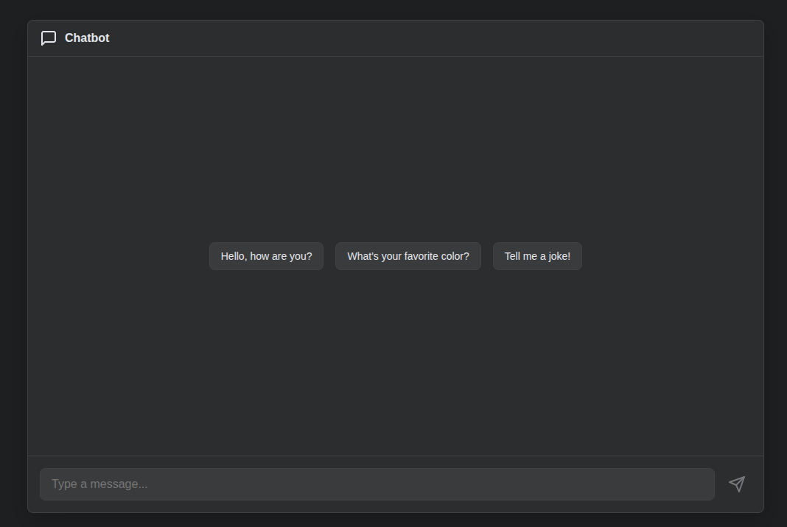
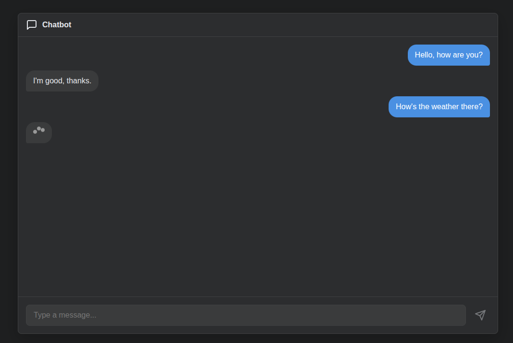

# Docker-HuggingFace-Chatbot

## Table of Contents

- [About](#about)
- [Architecture Overview](#architecture)
- [Installation](#install)
- [Preview](#preview)

## About <a name = "about"></a>

Docker-HuggingFace-Chatbot is a fully Dockerized chat application built using <b>FastAPI</b>, <b>React-Vite</b>, and a <b>Hugging Face–hosted conversational model</b>. It provides an end-to-end setup for delivering an simplistic AI chat experience, where the frontend and backend each run as separate but connected services.

The application uses <b>microsoft/DialoGPT-medium</b> for text-to-text conversational generation, with the model trained/hosted on <b>Hugging Face Spaces</b>. The backend (FastAPI) communicates with the Hugging Face model endpoint, and the frontend (React-Vite) provides a clean, responsive UI for users to chat with the model in real time.

## Architecture Overview <a name = "architecture"></a>

 - <b>Frontend</b> : React-Vite running in its own Docker container
 - <b>Backend</b> : FastAPI in a separate container
 - <b>Model</b> : Hosted on Hugging Face Space, accessed remotely
 - <b>Orchestration</b> : Docker Compose manages container creation, shared network, and cross-service communication

### Installation <a name = "install"></a>

 - Clone repository
```
git clone https://github.com/siddharth6758/chat-hf-docker.git
```

 - Build docker images using compose and run the services

```
docker-compose up --build
```

 - Access the frontend with this url:
 ```
 http://localhost:3000/
 ```

 - To stop:
 ```
 ctrl + c
 ```

 - To start again:
 ```
 docker-compose up
 ```
## Preview <a name = "preview"></a>

 - First look:
 
 - Chat responses:
 
